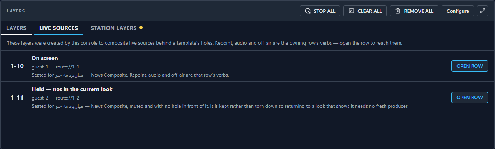
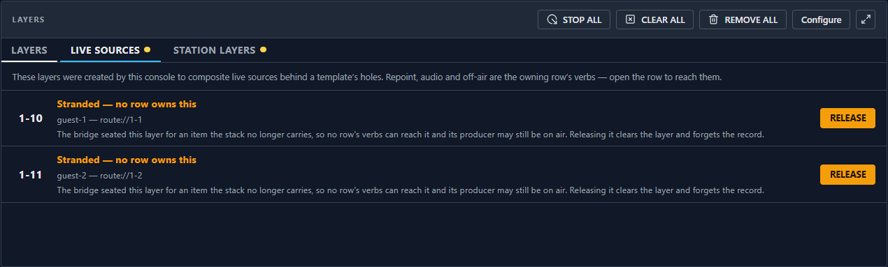
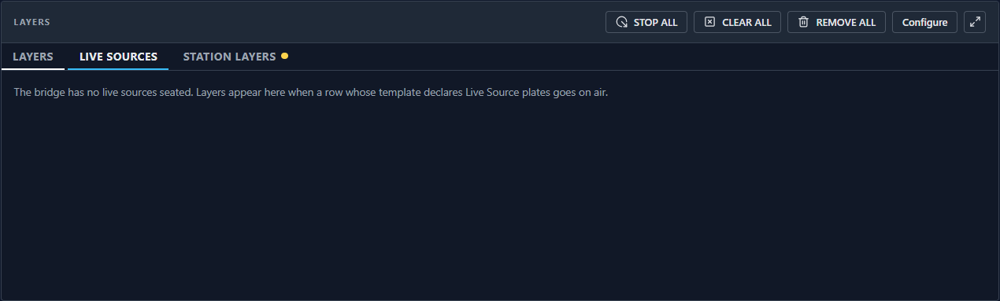

# Session BG — the live-layer ledger is VISIBLE: `B-145` closed, Stage E unblocked

> **Letter:** `BG`, not `BF`. `BF` stays reserved for the deferred hidden-look video/audio work
> (see §7), so the letter and the item it names do not drift apart.

## THE STATE, first (read this cold)

- **Pushed SHA:** see §8 — verified against `git ls-remote origin dev`. **Safe to pull.**
- 🔴 **`tasks.md` 2.8 is DONE, and it was Stage E's last blocker.** The operator surface (the look
  picker) is no longer blocked on anything.
- 🔴 **`B-145` is `[x]`.** Acceptance 1 read _"those layers **appear in the layer list** and are
  controllable"_. The control half had held since persistence landed; the display half did not exist.
  It does now.
- **Base read:** `c347987f` — exactly the expected tip, no delta, tree clean.
- ⚠ **Shared config changed — pull before you work.** `packages/shared-ipc` gained a channel, so the
  bridge and both apps rebuild.

## 1. The band's exclusion from `playoutLayersState()` — the reason, found and NOT overridden

The obvious fix is to widen `playoutLayersState()`. It is wrong, and the reason is recorded twice in
the tree (`live-layers.ts:18-26`, `caspar-runtime.ts:564-578`):

> `reservedLayers` is a fence AWAY from a foreign owner — the layer numbers the company's PLAYOUT
> SYSTEM owns. A Live Source layer is the exact inverse: a layer the BRIDGE owns. Putting one in
> `reservedLayers` makes it **unplaceable** (`allocate()` skips reserved layers), **unreservable**
> (`reserve()` refuses them) and **unclearable** (`clearLayer` refuses them as `reserved`).

So the exclusion is **load-bearing**, and the prompt's ⚠ applies: **a separate channel, not a wider
one.** That is also what the bridge's own model already says — `#declaredLayerClass` enumerates THREE
declared ownership classes (`playout` / `live-source` / `operator-row`), and the console had a surface
for two of them.

## 2. What changed

| layer     | file                                                                                                        |
| --------- | ----------------------------------------------------------------------------------------------------------- |
| wire      | `packages/shared-ipc/src/channels/liveLayers.ts` **(new)** + the barrel                                     |
| bridge    | `live-layers.ts` (`projectLiveLayers`), `caspar-runtime.ts` (`liveLayersState`), `bridge.ts` (route + push) |
| transport | `runtime-bridge.ts`, `WebSocketRuntime.ts`, `MockRuntime.ts`, `createRuntimeBridge.ts`                      |
| renderer  | `useLiveLayers.ts`, `liveLayerRows.ts`, `LiveSourcesPanel.tsx` **(new)**, `LayersPanel.tsx` (third tab)     |

**ONE projection.** `projectLiveLayers` is called by BOTH the pull (`liveLayersState()`) and the push,
so the two cannot disagree about a row's shape or the list's order — golden rule 6 applied to a
projection rather than a predicate.

**PUSH, not poll.** It rides the `liveLayersChanged` emitter `B-145` already fires from the ledger's
ONE write path, so a seat, a release, a hold and the boot adoption reach a browser by the same call
that persists them to disk.

**No new destructive door.** There is no clear verb on this channel. `layers.clear` refuses a
live-source coordinate BY NAME and its comment records that an exemption was weighed and rejected —
_"an exemption would make Live Source layers operator-CLEARABLE, inverting the protection."_ The one
control the surface offers (§4) calls the EXISTING `stack.remove`.

**§5 out-of-scope, untouched and verified so:** Stage E itself (the look picker), BF, BC's two
deferred findings (unchecked rollback `CLEAR`s, `#activeLooks` not persisted), the AW banner, P2.DEL.
`tools/caspar-bridge/src/template-http-server.ts` untouched.

## 3. 🔴 THE PRODUCTION CALLER — the whole point of the rule

```
LiveSourcesPanel.tsx
  → useLiveLayers()                      apps/runtime/src/renderer/hooks/useLiveLayers.ts
  → window.cg.liveLayers.state()         liveLayers.state
  → route(LiveLayersStateChannel, …)     tools/caspar-bridge/src/bridge.ts
  → CasparRuntime.liveLayersState()      caspar-runtime.ts
  → CasparRuntime.liveLayers()           ← was written-but-unreachable for a week
```

`liveLayers()`'s doc used to say _"for tests and for phase 6's re-emission"_, and that was true long
enough to be the defect. Its comment now names the caller and says why the previous wording mattered.

## 4. ADOPTED vs STRANDED — 2.8's "done when", and the asymmetry that makes it safe

- A layer whose owning item **the stack still carries** is shown, NAMED with its template, and offers
  **`OPEN ROW`** (select the item + return to the LAYERS tab, so the verbs are in front of you). It
  offers **no destructive control** — deliberately absent rather than disabled, because the reason is
  permanent and printed in the row.
- A layer whose owner is **GONE** reads **`Stranded — no row owns this`**, raises the tab's dot, and
  offers **`RELEASE`** behind a confirm that names the plate and producer.

**`RELEASE` is `stack.remove`, not a new clear.** `remove(itemId)` calls `teardownLiveLayers(itemId)`
**unconditionally on `slot`**, and its own comment says why that matters: _"the ledger is keyed by
itemId, so an item whose slot was already released can still own live layers, and those are precisely
the ones nothing else would ever reach."_ The door already existed and already worked; what was
missing was a surface that knew the `itemId` to hand it.

**Colour (§2.4).** Nothing on this surface is coloured unless it needs attention, and exactly one
state does. `held` is a normal disposition and wears a WORD. **Green is not used at all** — it is the
layer table's sacred ON AIR mark, and an on-screen plate borrowing it would put a second, unrelated
air claim on a different surface. Stranded is amber (`pending`), whose documented meaning in this
palette is exactly ATTENTION.

## 5. ⭐ The visual check — three steps, and you can do all of them

Take a row whose template declares Live Source plates, then open **LAYERS → LIVE SOURCES**.

1. **The band layers now appear**, one row each, with coordinate / plate / producer / owning row.
   Before this session that list showed **nothing** while the producers were lit on air.
   
   Note the tab strip: `LIVE SOURCES` sits between our own `LAYERS` and the station's, and only
   `STATION LAYERS` wears a dot — nothing here needs attention.
2. **Restart the bridge.** The rows come back (adopted from the persisted ledger, corrected against
   the server's `INFO`) and stay controllable through their row.
3. **A stranded layer** — one whose row is gone — is the only row that is coloured, and the only one
   with a control:
   
4. With nothing seated the tab says so rather than showing a bare list:
   

## 6. 🔴 What the screenshots could NOT show, and what I checked instead

- **The stranded row is not reachable from the offline mock at all.** The mock derives its ledger
  from its own stack, so removing the row releases the layer — it **cannot** strand one, which is
  deliberate (a mock that faked this alarm would teach test mode a state it can never really be in).
  `bg-step2-stranded.png` was produced by **temporarily** pointing the seed at a missing item and
  lifting that filter; **both edits were reverted** and the committed diff of `MockRuntime.ts` is
  additions only. What is committed instead:
  `liveSourcesPanel.dom.test.ts` renders the stranded row and asserts its markup
  (`data-live-layer-stranded="true"`, the RELEASE button, the confirm body naming plate and
  producer, and that `stack.remove` is called with the itemId), plus the pure gate without a DOM.
- **The restart (step 2) is not in a screenshot** — it needs a real bridge process. It is asserted
  end to end in `live-layers-wire.test.ts`: a bridge boots with a persisted ledger file, adopts it,
  and a WebSocket client reads the adopted rows back off `liveLayers.state`.
- **The link-down mask** is not photographable from a healthy offline mock; it is a DOM test.
- **Real hardware**: nothing here sends AMCP, so there is no hardware claim to make. The ledger is
  bookkeeping; the surface reads it.

## 7. BF stays deferred — recorded so nobody re-prioritises it by mistake

BF (a hidden look's `<video>` keeps decoding and playing audio) remains a **confirmed defect** and
stays open at `tasks.md` 9.3. It was briefly believed to explain the owner's on-air "2×" report and
**cannot have**: his template contains no `<video>` element (its looks hold Live Source plates and an
image background) and his media inputs have no audio track. **The 2× remains unexplained and
self-resolved**; the current best guess is a media-file frame rate vs channel mode mismatch, which is
outside this codebase. Not chased in this session.

## 8. Gate, E2E and the push

- `pnpm gate` green **uncached** — see §9 for the figures.
- **Tests added:** `tools/caspar-bridge/tests/live-layers-wire.test.ts` (17),
  `apps/runtime/tests/liveSourcesPanel.dom.test.ts` (18),
  `apps/runtime/tests/e2e/live-source-layers.spec.ts` (1). Eleven `window.cg` stubs in existing
  layer-panel DOM tests gained the new channel — a stub that omits one fails in whichever OTHER spec
  first renders a component reaching for it, which is how these surfaced.
- **Mutation-checked, six ways**, each reddening the tests that name it: dropping the coordinate
  sort; forcing `held` false; deleting the push subscription; removing the link-down mask; making an
  owned row releasable; and `liveLayersState()` returning `[]`.
- ⚠ **`awaitChannelModeRead` (flake family 3) deliberately NOT added, and that is a statement about
  these tests rather than a convenience:** the helper is required of a boot whose tests baseline the
  wire and assert the slice is empty. **No test here takes a silence baseline** — the ledger is
  bookkeeping that sends no AMCP, the unit tests open no sockets, and the two WS tests assert frames
  that ARRIVE. Adding it would imply a quiescence guarantee these assertions do not rest on. The file
  header records this.
- 🔴 **A Linux `gate:e2e` IS OWED** (this is a UI/render change). Its run URL is recorded in §9 and
  beside `tasks.md` 2.8 once the run completes green.
