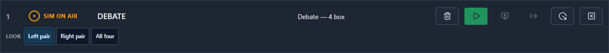
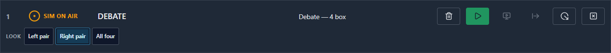

# Session BH — LOOKS Stage E: the operator can change a running row's look on air

> **Letter:** `BH`, the next free one. `BF` stays reserved for the deferred hidden-look
> video/audio item, so the letter and the item it names do not drift apart.

## THE STATE, first (read this cold)

- **Pushed SHA:** `0b6da4998107281915233504f166c4652c268d61` on `dev`, verified against
  `git ls-remote origin dev`. **Safe to pull.**
- ✅ **Linux `gate:e2e` DISCHARGED:**
  <https://github.com/yasermostafaee/cg/actions/runs/32424237246> — `0b6da499`, `completed` +
  `success`, **`E2E (Playwright)` RAN** (22:37:28 → 22:46:35 UTC). ⚠ On the RETRY: the first
  attempt hit a known open flake (`video-import.spec.ts:291`), recorded as its third occurrence in
  `docs/prd/platform.md` rather than waved through — see §8.
- ⭐ **THE FEATURE THE CLIENT ASKED FOR IS COMPLETE.** An operator picks a look on the row and
  the boxes change on air. Everything under it had landed; this is the surface.
- **Base read:** `9b587ddc` — exactly the expected tip, no delta, tree clean.
- ⚠ **Shared config changed — pull before you work.** `@cg/shared-schema` and `@cg/shared-ipc`
  both gained fields/channels, so the bridge and both apps rebuild.

## 1. What this session did

Built the **look picker** on the Runtime row: always visible on look-bearing rows, marking the
live look, one press to switch. Wired it to the shipped seam (`setActiveLook` →
`reconcileLivePlates` → the `__cg` payload → the page's `enterLook`) through a new
`stack.set-active-look` channel. Added the one refusal LOOKS has, made an active `sourceOverride`
visible outside the swap dialog, and answered §4's carried question.

## 2. What changed

| layer     | files                                                                                         |
| --------- | --------------------------------------------------------------------------------------------- |
| schema    | `StackItemState.activeLookId` (the readout, on the OPEN axis beside `sourceOverride`)         |
| wire      | `stack.set-active-look`                                                                       |
| bridge    | `#published()` publishes the RESOLVED look; `#refuseNoLooksAuthored` at the take door         |
| transport | contract, `WebSocketRuntime`, `MockRuntime`, `createRuntimeBridge`, parity                    |
| renderer  | `LookPicker.tsx`, `lookSwitch.ts`, `LayerRow` second line, `controls.css`, `errorCodeMessage` |
| §12.5     | `onAirPlateSource` + the LIVE PLATES on-air line + the live path named                        |
| §4        | `link.resyncing()` exposed; `useStackDeliveryPending`; `liveLayerBlindness` sharpened         |

**§6's scope untouched and verified so:** BF (and the still-unexplained 2× — not chased), BC's two
deferred findings (unchecked rollback `CLEAR`s, `#activeLooks` not persisted), the AW banner,
P2.DEL. `tools/caspar-bridge/src/template-http-server.ts` untouched.

## 3. ⭐ What to check — the walk, on the plant

1. Take a row whose template has a multi-box look group → **the picker shows the live look**, the
   authored default, before you touch anything.
2. **Press another look** — one action. The boxes cut to it; sources the new look does not show are
   HELD, not torn down.
3. **Preset then switch:** point a source the CURRENT look does not show at a different input
   (row → SOURCE). Nothing moves. Now switch to a look that shows it — **it comes up on the new
   input, at the moment of the switch.**
4. **Switch back** — every box returns with no operator action and no re-acquire.
5. The **cut is the only mode**, so the press IS the immediate action; STOP/CLEAR remain the way
   off air, always present in the verb block.

## 4. §2b answered — placement, the shape rule, and density

**Placement: a second line spanning `gridColumn: 1 / -1`.** The row's outer element IS the grid, so
a spanning child lands on a new implicit row and adds **no column**. `VERB_COUNT` stays 6,
`gridTemplateColumns(density)` is untouched, `minWidthFor` sums the same columns, and the header
words stay above their own glyphs — the invariant with a recorded on-air failure behind it.

**The SHAPE RULE does not govern it, and I am stating that rather than implying it.** The rule is
about the VERB BLOCK — _"every row declares the SAME verbs in the SAME order"_ — and exists so a
verb never moves under a hand already reaching for one. The picker is not a verb and is not in that
block. It IS conditional (only look-bearing rows have one), which a reader who assumed the rule
applied would call a violation.

**Density:** the line spans whatever columns exist, so it is correct at all three. It can never
widen the row — the strip is `overflow-x: auto; min-width: 0`, so a long look list scrolls inside
the line instead of pushing the grid out and clipping a verb. Pinned by arithmetic, not by eye:
`minWidthFor('full')` and `minWidthFor('tight')` are asserted to their exact values.

## 5. §4 answered — loaded-empty IS distinguishable, and the fact already existed

**Distinguishable, with one small honest addition — and it is an exposed FACT, not an inference.**

`useBridgeSnapshot`'s `ready` cannot answer it: it _"latches on the FIRST arrival and never
clears"_. But `WebSocketRuntime` has always tracked `#resyncing` — set before the first await of a
resync, cleared on all three exit paths — purely to suppress retention mirroring. It simply never
left that class. It is now `link.resyncing()` on the bridge contract, with every write routed
through one `#setResyncing` so the five sites cannot drift.

So: **empty + delivery pending → blind; empty + settled → that IS the answer, and the stranding
alarm is restored for it.** That is what the owner asked for, and BG's true-positive cost is paid
back.

🔴 **I rejected the alternative and it is worth saying why.** "Retention says N rows, the bridge
says 0" is a _correlated_ question, not this one, and it fails both ways: a restore that THREW
leaves retention at N forever (alarm suppressed permanently), and a browser with empty retention
reconnecting to a restarted bridge reads "genuinely empty" while another console is 200 ms from
restoring those rows. Arming a control that cuts a live guest on a derived neighbour of the real
fact is the `B-101` shape.

⚠ **The residual, stated rather than papered over:** this closes the SELF race completely. It does
**not** close the multi-browser one — one bridge serves many browsers, and this browser cannot know
another is about to restore the rows. That is genuinely undecidable from here and would need a
bridge-side "every client has re-delivered" fact, which does not exist. It is written into the
`LiveLayerBlindness` doc, and the confirm dialog remains the last guard.

## 6. 🔴 What the screenshots could NOT show, and what I checked instead

- **The boxes actually moving on air.** No screenshot of the console can show the SDI output. What
  is proven instead is the COMMAND SEQUENCE, on the AMCP trace: fills move, _then_ the page is told,
  in that order and only on success; the switch emits no duration and no tween (so it is a cut); and
  a held plate never re-`PLAY`s on the way back. Whether that reads as a clean cut on a 2.3.2 server
  remains a plant measurement — **step 2 of §3 is the one thing I cannot do from here.**
- **Preset-then-take** is invisible by construction — its whole point is that nothing changes until
  the switch. Asserted as an EMPTY wire slice after the preset, then the new producer after the
  switch.
- **The §4 reconnect window** cannot be photographed at all; it is a DOM test with the delivery flag
  driven both ways.
- The screenshots are from the offline mock's e2e-armed seed (a 4-box template with three looks, two
  of them disjoint), not from a plant.

## 6b. 🔴 Two defects found by reviewing this change, both fixed before the tip settled

Both are the same shape: **the picker is a new READOUT, and a readout makes previously-invisible
divergence into a visible lie.**

**(i) The refusal was at the TAKE door only.** §12.6’s exclusivity refusal is at BOTH the take and
the restore, and its own comment says why — _“restore is the door with no other cover”_, it never
passes through `take()`. Mine was not. The path is narrow but real: the TEMPLATE changes under a
retained row — the operator takes a template that has looks, re-imports it with the group emptied,
and a reconnect restores an on-air row against the new definition, seating nothing and putting a
designed layout of empty holes on air, silently, on a link that just came back. `looks-none-authored`
is now a `RestoreSkipReason` with its own operator wording. One predicate, two sites.

**(ii) The picker would have LIED after a bridge blip.** `#activeLooks` is process memory, so a
restore resolved the row to its AUTHORED DEFAULT — and both outcomes are wrong in a way somebody
sees. If the producer survived and was ADOPTED, the page is still showing the operator’s look while
the row publishes the default: **the picker asserts a look that is not on air.** If the row was
RE-ADDed, the page enters the default and the operator’s choice is silently undone.

Before this session nothing displayed the look, so the divergence was invisible — which is precisely
why it was never caught. Fixed the way its three neighbours already are: `activeLookId` on
`RetainedStackItem`, carried by `StackRetentionStore.toRetained`, re-applied on restore BEFORE any
adopt-vs-re-ADD decision. That is the `B-107`/`B-109` class the retention doc already names.

⚠ **This does NOT close BC’s deferred finding.** `#activeLooks` is still not persisted BY the
bridge; the gap is closed from the side that already has a durable store and already re-delivers.
A bridge restarted with NO browser attached still loses the look. That item stays open.

## 6c. 🔴 And three more, one of them caught by CI rather than by me

**(iii) CI WENT RED, and this is the one to read.** The Linux `e2e` job failed on `c1abfd4b`:
`fixed-layers.spec.ts` asserts the seeded bank renders exactly **19** rows, and adding the
look-bearing row made it 20. **My Windows run passed because I ran the new spec, not the suite** —
the precise mistake the authoritative-Linux rule exists to catch, and I made it. The assertion is
right and was doing its job: it pins that the bank renders EXACTLY its declared rows, which is what
R-021 exists to guarantee, so a seed cannot be added quietly. Count updated with the reason beside
it, and the full runtime E2E suite run locally before the next push rather than one spec.

**(iv) The picker segments used `variant="verb"`, which is COLUMN geometry.** `.cg-btn--verb` sets
`width: 100%` so a verb fills the column the header sized — and the `icon` variant exists precisely
because that _“stretches anything that is not in a sized column”_. These sit in a flex strip. Now
`neutral` (the documented contract for a TEXT button, and accent-free, which is what the row wants),
with an explicit `width: auto` in `.cg-look-cell` so a future variant change cannot silently reflow
the strip.

**(v) The marked segment announced “— on air” regardless of the row’s state.** An off-air row’s
picker would have told a screen-reader user a graphic was on air. It now says **“current”**: the
picker’s claim is which LOOK is selected, and whether the row is on air belongs to the state cell
alone — the same reason the segments do not wear green.

## 6d. 🔴 Two more from the review — one fixed, one FILED FOR YOU rather than changed

**(vi) FIXED — the switch did not publish the stack for itself.** `#markDirty` is the only thing
that emits `stackChanged`, and `setActiveLook` never called it. ⚠ **The reviewer’s claim was that
the picker would NEVER update; that was too strong and I checked rather than repeating it.** On an
ON-AIR row the reconcile’s own AMCP produces acks that move the reconciler, which publishes anyway
— so it worked, by a neighbouring mechanism rather than because the code said so. Where it genuinely
failed is the OFF-AIR row, which the picker explicitly supports (pre-setting the look a take will
enter): nothing is sent, so nothing acks, so the picker never moved. Fixed, and the test is written
against the off-air case for exactly that reason — removing the publish leaves the on-air test green.
⚠ The offline mock had this right from the start, so **the mock was MORE correct than the bridge and
the E2E passed too.**

**(vii) 🔴 FILED, NOT FIXED — `tasks.md` 7.9, and it needs your call because the fix changes an
on-air verb.** `setActiveLook` records the look before the reconcile and keeps it on refusal (BC’s
deliberate decision). `swapLiveSource` then reconciles against `#desiredPlateRects`, which resolves
from that same recorded look — and never sends `updateLook`. So: a switch is refused, the operator
is told, and a later unrelated source swap moves the FILLS to the new look while the page is still
punching the OLD look’s holes. **A designed layout with its boxes in the wrong holes, arriving from
an action that never mentioned looks.**

It was unreachable before this session — `setActiveLook` had no operator caller — so the picker is
what makes it reachable, which is why I am filing it rather than leaving it unsaid. §6/§12.2 already
names the rule it breaks (_the hole the page punches and the hole the bridge fills are ONE
computation_), so the candidate fix is to have any reconcile that resolves against the active look
also tell the page. **I did not make that change:** it alters `R-048`’s shipped behaviour and belongs
to a deliberate decision, not a session-end patch.

## 7. One correction to the prompt, and one judgement to check

⚠ **§3.6 asked for the immediate-CUT escape; `tasks.md` 7.6 RETIRED it on 2026-08-19.** These agree
in substance — the prompt itself says "the mode is cut-only in v1" — so I built no separate control
and instead **asserted** the claim rather than assuming it: every fill a switch emits carries no
duration or tween, and STOP/CLEAR stay in the verb block. If you did want a distinct control, say so
and I will add one; I read the retirement as still correct.

⚠ **The look segments were labelled by ORDINAL, and the reason I gave for it was FALSE.** I wrote
that “the carrier holds ids, not display names”. It does not: `TemplateLookSchema.name` is
`z.string().min(1)` — REQUIRED, and it is what the author typed in the Designer. Numbering them
threw away the one label that already means something to an operator (“WIDE”, “SOLO”) and replaced
it with a position they would have to learn. **The segments now carry the authored name**, with the
id still on the tooltip and the accessible name. This was a judgement I flagged for you to check and
it turned out simply to be wrong, so it is corrected rather than left for you to arbitrate.

## 8. Gate, tests and the push

- `pnpm gate` green **uncached** — `0 cached, 89 total`.
- **Tests:** `tools/caspar-bridge/tests/look-picker-operator.integration.test.ts` (15, including the
  **disjoint-membership** switch), `apps/runtime/tests/lookPicker.dom.test.ts` (22),
  `apps/runtime/tests/e2e/look-picker.spec.ts` (3). Existing suites: 840 runtime, 550 bridge.
- 🔴 **The disjoint-membership test (5.3) found nothing** — the release-and-seat path was already
  correct, which is the outcome BC's held-layer fix predicts. It is kept because that shape is what
  HID the original bug: every earlier switch was a subset of the one before it.
- ⚠ One test of mine was wrong and the code was right: I asserted no `PLAY` on a switch that seats
  two never-seated plates. A first-time seat needs its producer; "never PLAY on a switch" would be
  the wrong rule. The test now pins the real distinction and says so.
- `awaitChannelModeRead()` IS called in the new bridge boot (5.6) — several tests there baseline the
  trace and assert an EMPTY slice, which is only valid from a proven-quiescent wire.
- ✅ **Linux `gate:e2e` discharged** — run 32424237246 on `0b6da499`, `E2E (Playwright)` RAN and
  passed. **The first attempt was RED**, on `apps/designer/tests/e2e/video-import.spec.ts:291`.
  I did not call that flake on a hunch: it is already recorded in `docs/prd/platform.md` as a
  KNOWN, OPEN, unexplained flake at that exact spec and line, it passed on my immediately
  preceding run, and `git diff 9b587ddc..0b6da499` over `apps/designer`, `packages/vcg-format`,
  `packages/template-runtime` and the video schema is EMPTY. I have added it there as the THIRD
  occurrence — two of the three now on the same line, which is the first thing about it that looks
  like a pattern.
  ⚠ **The local Designer suite is NOT evidence here and I did not use it as such:** on this Windows
  host it fails 7 of 8 in that spec with `toContainText` (the conversion never completes), a
  different failure mode from CI’s pixel threshold.
