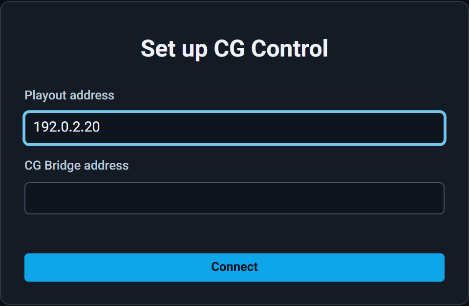
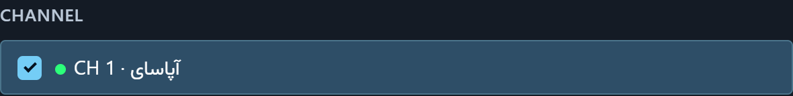

# راهنمای نصب APASAI CG — نسخهٔ آزمایشی `0.10.0`

این راهنما برای نصبِ بدون حضورِ ما نوشته شده است. گام‌ها را به همین ترتیب انجام دهید: نخست CG Bridge، سپس CG Control، سپس CG Designer.

## ۱. در بسته چه هست

- `CG-Bridge_0.10.0_x64-setup.exe` — سرویسِ CG Bridge: پلِ میانِ برنامه‌های CG Control و CasparCG. یک بار نصب می‌شود، روی رایانهٔ Playout یا روی سروری کنارِ آن.
- `CG-Control_0.10.0_x64-setup.exe` — برنامهٔ کنترلِ گرافیک روی آنتن. روی هر رایانه‌ای که اپراتور با آن کار می‌کند نصب شود؛ چند CG Control می‌توانند هم‌زمان به یک CG Bridge وصل شوند.
- `CG-Designer_0.10.0_x64-setup.exe` — برنامهٔ ساختِ قالب. روی رایانهٔ طراح نصب شود.
- `SHA256SUMS.txt` — برای وارسیِ درستیِ فایل‌ها.
- همین راهنما.

## ۲. پیش‌نیازها

- ویندوز ۱۰ یا ۱۱، ۶۴ بیتی. اینترنت لازم نیست.
- Playout نسخهٔ `2.9.0` یا تازه‌تر؛ `2.9.2` پیشنهاد می‌شود.
- رایانهٔ Playout، سرورِ CG Bridge (اگر جداست) و رایانه‌های CG Control در یک شبکه باشند.
- اگر CG Bridge را روی سرورِ جداگانه نصب می‌کنید، آن سرور یک **IP ثابت** داشته باشد. Playout آن سرور را با IP آن می‌شناسد؛ اگر IP عوض شود، مدیر Playout باید دوباره آن را تأیید کند.
- پیش از شروع، از مدیر Playout بگیرید: **آدرس Playout**، و **گذرواژهٔ حساب `cg-admin`**.
- اگر CG Control نسخهٔ `0.9.x` روی رایانه‌ای هست، پیش از هر کار آن را از `Installed apps` حذف کنید.

## ۳. نصب CG Bridge

CG Bridge در یکی از این دو جا نصب می‌شود:

- **روی رایانهٔ Playout — پیشنهاد ما.** CG Bridge با CasparCG روی همان رایانه کار می‌کند و تأییدی از Playout لازم ندارد.
- **روی سروری کنارِ Playout.** وقتی نمی‌خواهید روی رایانهٔ Playout چیزی نصب شود. نصب از خطِ فرمان انجام می‌شود (گامِ ۳).

1. روی رایانهٔ Playout، `CG-Bridge_0.10.0_x64-setup.exe` را اجرا کنید. این نسخه امضای دیجیتال ندارد؛ ویندوز ممکن است صفحهٔ آبیِ `Windows protected your PC` را نشان دهد. روی `More info` و سپس `Run anyway` بزنید.
2. ویندوز اجازهٔ مدیر (Administrator) می‌خواهد؛ `Yes` را بزنید. نصب، CG Bridge را سرویسِ ویندوز می‌کند: با روشن شدنِ رایانه خودش اجرا می‌شود و اگر از کار بیفتد ویندوز دوباره اجرایش می‌کند. نصب، درگاه‌های TCP 5280 و 7911 و UDP 6251 و 6252 را فقط برای خودِ CG Bridge در دیوارهٔ آتشِ ویندوز باز می‌کند؛ کار دیگری لازم نیست.
3. روی سرورِ جداگانه: در PowerShell با اجازهٔ مدیر، آدرس Playout و IP ِ رایانهٔ Playout را به نصب بدهید، و IP ِ خودِ این سرور را (نمونه‌ها را با آدرس‌های خودتان عوض کنید):
   `.\CG-Bridge_0.10.0_x64-setup.exe /S /PLAYOUT=http://192.0.2.10:8080 /AMCPHOST=192.0.2.10 /BRIDGEADDRESS=192.0.2.20`
4. وارسی: روی همان رایانه، در مرورگر `http://127.0.0.1:5280/health` را باز کنید. باید `cg-bridge` و `0.10.0` را ببینید.

## ۴. نصب CG Control

1. `CG-Control_0.10.0_x64-setup.exe` را روی رایانهٔ اپراتور اجرا کنید (همان هشدارِ ویندوز: `More info` و `Run anyway`).
2. اجازهٔ مدیر لازم ندارد و درگاهی باز نمی‌کند. روی هر رایانهٔ اپراتور همین کار را بکنید.

## ۵. اجرای نخست

1. CG Control را باز کنید. چند ثانیه صفحهٔ آغاز با نوشتهٔ `CONNECTING` دیده می‌شود.
2. بارِ نخست، پنجرهٔ `Set up CG Control` می‌پرسد Playout کجاست. در `Playout address` آدرس Playout را بنویسید (IP آن کافی است). اگر CG Bridge روی سرورِ جداگانه است، IP ِ آن سرور را در `CG Bridge address` بنویسید؛ وگرنه آن را خالی بگذارید. سپس `Connect` را بزنید.
3. اگر ایستگاه هنوز راه‌اندازی نشده، پنجرهٔ `Set up CG Control` زیرِ `PLAYOUT` آدرس Playout را نشان می‌دهد و آن را وارسی می‌کند. سطرِ CasparCG می‌گوید `waiting for sign-in`؛ این عادی است.
4. زیرِ `SIGN IN`، در `Username` بنویسید `cg-admin`. گذرواژه را در Playout بردارید: «تنظیمات ← اتصال به CG Control ← حسابِ داخلیِ CG Control»، با دکمهٔ کپیِ کنار آن. در `Password` بچسبانید و `Sign in` را بزنید.
5. اگر CG Bridge روی سرورِ جداگانه است و سطرِ CasparCG نوشت `waiting for approval`، مدیر Playout آن سرور را در همان صفحه («تنظیمات ← اتصال به CG Control») تأیید کند [confirm with the Playout team]. یک بار فهرستِ همان صفحه را ببینید: فقط همان سرور باید آنجا باشد.
6. زیرِ `CHANNEL` کانال یا کانال‌هایی را که این ایستگاه کنترل می‌کند تیک بزنید. آدرسِ CG Bridge زیرِ `SERVE ADDRESS` خودکار نوشته می‌شود؛ آن را تغییر ندهید، مگر به گفتهٔ مدیر Playout. سپس `Use this channel` (یا `Use these channels`) را بزنید.
7. CG Bridge خودش هم یک بار با `cg-admin` وارد Playout می‌شود. اگر نوشتهٔ `CG Bridge needs a station admin to sign in` دیده شد، روی `Sign in CG Bridge…` بزنید، گذرواژهٔ `cg-admin` را بچسبانید و وارد شوید. گذرواژه هیچ‌جا نگه داشته نمی‌شود.
8. رایانه‌های اپراتورِ دیگر فقط گامِ ۲ را انجام می‌دهند و سپس وارد می‌شوند.

## ۶. نصب CG Designer

1. `CG-Designer_0.10.0_x64-setup.exe` را اجرا کنید (همان هشدارِ ویندوز: `More info` و `Run anyway`). اجازهٔ مدیر و ورود لازم ندارد.
2. در صفحهٔ آغاز `+ New project` را بزنید، یا یکی از قالب‌های زیرِ `START FROM A TEMPLATE` را باز کنید، و قالب را بسازید.
3. پایینِ فهرستِ `Compositions`، دکمهٔ `Export (.vcg)` را بزنید و فایل را ذخیره کنید.
4. در CG Control، روی یک ردیف `LOAD` را بزنید؛ در پنجرهٔ باز شده `Import a .vcg` را بزنید و فایلِ `.vcg` را انتخاب کنید (یا فایل را روی همان پنجره بکشید).

## ۷. پیغام‌های CG Control

- `CG Bridge not reachable at` … — CG Control به CG Bridge نمی‌رسد؛ دنبالهٔ همان سطر می‌گوید چرا:
  - `nothing is listening on port` … — CG Bridge روی آن رایانه اجرا نمی‌شود. روی همان رایانه، در `Services` سرویسِ `CG Bridge` را پیدا کنید و اجرایش کنید؛ اگر نبود، CG Bridge را نصب کنید.
  - `does not answer (switched off, a wrong address, or a firewall)` — آن رایانه روشن نیست، آدرس اشتباه است، یا شبکه راه نمی‌دهد. آدرس و شبکه را وارسی کنید.
  - `something there answers, but not as CG Bridge` — آن آدرس از آنِ برنامهٔ دیگری است؛ آدرس را وارسی کنید.
  - اگر آدرس از اول اشتباه نوشته شده، روی `Set up again` بزنید تا CG Control دوباره آدرس را بپرسد.
- `CG Bridge needs a station admin to sign in` — گامِ ۷ ِ بخشِ ۵ را انجام دهید.
- `CG Bridge:` و سپس پیغامی از خودِ Playout — Playout کار را نپذیرفته است، معمولاً به خاطرِ پروانهٔ CG. همان پیغام را به مدیر Playout بدهید؛ CG Bridge هر دقیقه خودش دوباره تلاش می‌کند.
- … `are different releases` … — نسخهٔ CG Control و CG Bridge یکی نیست و هیچ فرمانی فرستاده نمی‌شود. هر دو را از یک بسته نصب کنید.

## ۸. گزارش مشکل

1. در CG Control، بالای پنجره `LOG` را بزنید؛ در پنجرهٔ `Audit log` دکمهٔ `Download logs` را بزنید. این دکمه فقط برای مدیرِ ایستگاه است و همهٔ پرونده‌های CG Bridge را در یک فایلِ zip می‌دهد.
2. آن فایلِ zip را، با یک عکس از صفحه و زمانِ دقیقِ رخداد، برای ما بفرستید.
3. نسخه: CG Control در `SETTINGS` (پایینِ ستونِ کناری) می‌نویسد `Version 0.10.0`؛ CG Designer همین را در صفحهٔ آغاز و در `Help` ← `About` می‌نویسد؛ CG Bridge آن را در `http://127.0.0.1:5280/health` می‌نویسد.

## ۹. محدودیت‌های این نسخهٔ آزمایشی

- به‌روزرسانیِ خودکار ندارد؛ نسخهٔ تازه را خودتان نصب کنید، نخست CG Bridge.
- امضای دیجیتال ندارد؛ برای همین ویندوز هشدار می‌دهد.
- فقط یک حساب دارد: `cg-admin`.
