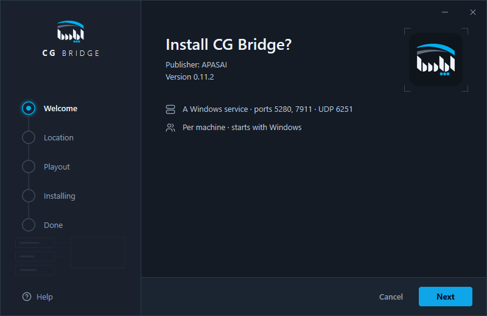
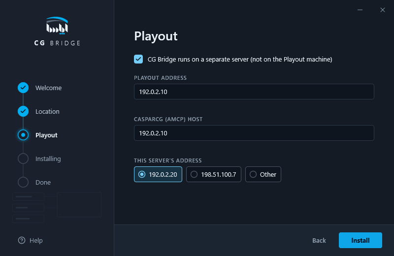
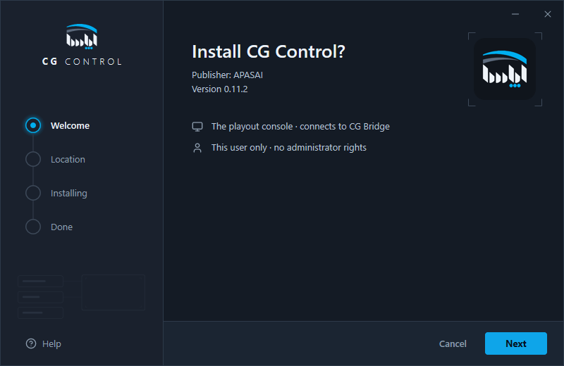
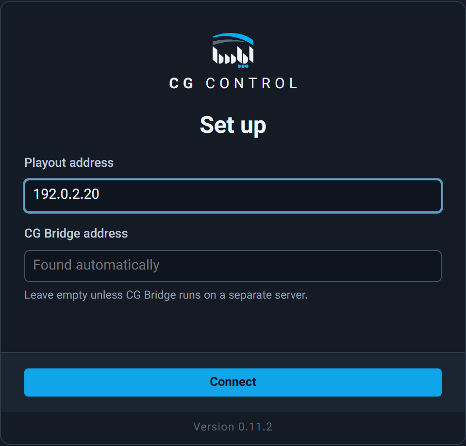
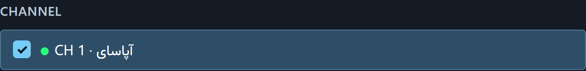

# راهنمای نصب APASAI CG — نسخهٔ `0.11.3`

این راهنما برای نصبِ بدون حضورِ ما نوشته شده است. گام‌ها را به همین ترتیب انجام دهید: نخست CG Bridge، سپس CG Control، سپس CG Designer.

## ۱. در بسته چه هست

- `CG-Bridge_0.11.3_x64-setup.exe` — سرویسِ CG Bridge: پلِ میانِ CG Control و CasparCG. یک بار نصب می‌شود، روی رایانهٔ Playout یا روی سروری کنارِ آن.
- `CG-Control_0.11.3_x64-setup.exe` — برنامهٔ کنترلِ گرافیک روی آنتن. روی هر رایانهٔ اپراتور نصب شود؛ چند CG Control می‌توانند هم‌زمان به یک CG Bridge وصل شوند.
- `CG-Designer_0.11.3_x64-setup.exe` — برنامهٔ ساختِ قالب. روی رایانهٔ طراح نصب شود.
- `SHA256SUMS.txt` — برای وارسیِ درستیِ فایل‌ها.
- همین راهنما.

CG Control بدونِ CG Bridge کار نمی‌کند. هر سه را از همین بسته نصب کنید.

## ۲. پیش‌نیازها

- ویندوز ۱۰ یا ۱۱، ۶۴ بیتی. اینترنت لازم نیست.
- Playout نسخهٔ `2.9.2`. کمترین نسخه `2.9.0` است.
- روی `2.9.0` و `2.9.1` این‌ها نیست: خطِ پروانهٔ CG، نمایشگرِ صدای PROGRAM، و خروجیِ پلی‌لیست به‌عنوانِ منبعِ جعبه.
- روی `2.9.0` این‌ها هم نیست: کلیپِ سرورِ پشتیبان، و جلوگیری از انتخابِ خروجیِ همان کانال به‌عنوانِ منبع.
- CG Control فقط جایی کار می‌کند که پروانهٔ Playout شاملِ CG باشد.
- رایانهٔ Playout، سرورِ CG Bridge (اگر جداست) و رایانه‌های CG Control در یک شبکه باشند.
- اگر CG Bridge را روی سرورِ جداگانه نصب می‌کنید، آن سرور یک **IP ثابت** داشته باشد. این را خودتان در تنظیماتِ شبکهٔ ویندوز بگذارید؛ نصب آن را نمی‌گذارد. Playout آن سرور را با IP آن می‌شناسد؛ اگر IP عوض شود، مدیر Playout باید دوباره آن را تأیید کند.
- پیش از شروع، از مدیر Playout بگیرید: **آدرس Playout**، و **گذرواژهٔ حساب `cg-admin`**.
- اگر نسخهٔ پیشینی نصب است (`0.10.0`، `0.11.0`، `0.11.1` یا `0.11.2`)، چیزی را حذف نکنید. `0.11.3` را به همین ترتیب روی آن نصب کنید. نصب، با نسخهٔ نصب‌شدهٔ خودتان، می‌نویسد برای نمونه `Update from 0.10.0 to 0.11.3. Your settings are kept.` و تنظیمات می‌ماند.
- با موتورِ پشتیبان، `0.11.2` و نسخه‌های پیش از آن را به کار نبرید: آن‌ها فرمانِ هر کانال را با شمارهٔ کانالِ موتورِ اصلی به موتورِ پشتیبان می‌فرستند، که آنجا کانالِ دیگری است. `0.11.3` را روی آن نصب کنید.

## ۳. نصب CG Bridge

CG Bridge در یکی از این دو جا نصب می‌شود:

- **روی رایانهٔ Playout — پیشنهادِ ما برای ایستگاهی با یک موتور.** CG Bridge با CasparCG روی همان رایانه کار می‌کند و تأییدی از Playout لازم ندارد.
- **روی سروری کنارِ Playout.** وقتی نمی‌خواهید روی رایانهٔ Playout چیزی نصب شود، و همیشه وقتی ایستگاه موتورِ پشتیبان دارد (بخشِ ۶). نصب همان است، با چند خانهٔ بیشتر (گامِ ۴).

نصبِ Playout از نسخهٔ `2.9.4` در یکی از صفحه‌هایش، زیرِ سطرِ «CG Control (اگر CG Bridge روی سرورِ جداست، تیک را بردارید):»، گزینهٔ «CG Bridge هم نصب شود» را دارد. این گزینه از پیش تیک دارد و CG Bridge را روی رایانهٔ Playout نصب می‌کند؛ در آن صورت گام‌های ۱ تا ۴ را انجام ندهید و به گامِ ۵ بروید. با نسخه‌های پیشینِ Playout، گام‌های زیر را خودتان روی رایانهٔ Playout انجام دهید.

- اگر CG Bridge با همین نسخه یا تازه‌تر از پیش نصب است، نصبِ Playout به آن دست نمی‌زند.
- حذفِ Playout، CG Bridge را حذف نمی‌کند.
- اگر نصبِ CG Bridge در نصبِ Playout ناکام بماند، نصبِ Playout برنمی‌گردد؛ CG Bridge را با گام‌های زیر نصب کنید.

1. `CG-Bridge_0.11.3_x64-setup.exe` را اجرا کنید. این نسخه امضای دیجیتال ندارد؛ ویندوز ممکن است صفحهٔ آبیِ `Windows protected your PC` را نشان دهد. روی `More info` و سپس `Run anyway` بزنید.
2. ویندوز اجازهٔ مدیر (Administrator) می‌خواهد؛ `Yes` را بزنید.
3. روی رایانهٔ Playout: در صفحهٔ `Install CG Bridge?` دو بار `Next` را بزنید. در صفحهٔ `Playout`، گزینهٔ `CG Bridge runs on a separate server (not on the Playout machine)` را تیک نزنید و `Install` را بزنید. در پایان، `Finish` را بزنید. نصب، CG Bridge را سرویسِ ویندوز می‌کند: با روشن شدنِ رایانه خودش اجرا می‌شود و اگر از کار بیفتد ویندوز دوباره اجرایش می‌کند. نصب، درگاه‌های TCP 5280 و 7911 و UDP 6251 و 6252 را فقط برای خودِ CG Bridge در دیوارهٔ آتشِ ویندوز باز می‌کند؛ کار دیگری لازم نیست.
4. روی سرورِ جداگانه: همان گامِ ۳، ولی در صفحهٔ `Playout` گزینهٔ `CG Bridge runs on a separate server (not on the Playout machine)` را تیک بزنید. در `PLAYOUT ADDRESS` آدرس Playout را بنویسید (IP آن کافی است؛ با موتورِ پشتیبان، آدرسِ موتورِ **اصلی**). `CASPARCG (AMCP) HOST` همان را می‌گیرد؛ آن را فقط اگر CasparCG روی رایانهٔ دیگری است عوض کنید. زیرِ `THIS SERVER'S ADDRESS`، IP ثابتِ همین سرور را انتخاب کنید. اگر چیزی درست نباشد، نصب آغاز نمی‌شود و زیرِ همان خانه نوشته می‌شود چرا. پس از نصب، مدیر Playout این سرور را یک بار «تأیید» می‌کند (بخشِ ۵، گامِ ۵).
5. وارسی: در صفحهٔ آخرِ نصب، `Open CG Bridge status` تیک دارد. با `Finish` صفحهٔ `http://127.0.0.1:5280/health` باز می‌شود؛ باید `cg-bridge` و `0.11.3` را ببینید.

## ۴. نصب CG Control

1. `CG-Control_0.11.3_x64-setup.exe` را روی رایانهٔ اپراتور اجرا کنید (همان هشدارِ ویندوز: `More info` و `Run anyway`).
2. اجازهٔ مدیر لازم ندارد و درگاهی باز نمی‌کند. در صفحهٔ `Install CG Control?` دکمهٔ `Next` و سپس `Install` را بزنید. در صفحهٔ آخر، `Launch when ready` تیک دارد؛ `Finish` برنامه را باز می‌کند.
3. روی هر رایانهٔ اپراتور همین کار را بکنید.

## ۵. اجرای نخست

1. CG Control را باز کنید. چند ثانیه صفحهٔ آغاز با نوشتهٔ `CONNECTING` دیده می‌شود.
2. بارِ نخست، پنجرهٔ `Set up CG Control` می‌پرسد Playout کجاست. در `Playout address` آدرس Playout را بنویسید (IP آن کافی است). `CG Bridge address` را خالی بگذارید (در آن نوشته است `Found automatically`)؛ CG Bridge خودش پیدا می‌شود. فقط اگر CG Bridge روی سرورِ جداگانه است، IP ِ آن سرور را بنویسید. سپس `Connect` را بزنید.
3. اگر ایستگاه هنوز راه‌اندازی نشده، پنجرهٔ `Set up CG Control` اتصال را می‌آزماید و نتیجه را در چهار گروه، به همین ترتیب، نشان می‌دهد: `Reachable`، `Versions`، `Sign-in`، `After sign-in`. پیش از ورود، سطرهای گروهِ آخر منتظرِ ورودند؛ این عادی است.
4. زیرِ `SIGN IN`، در `Username` بنویسید `cg-admin`. گذرواژه را در Playout بردارید: «تنظیمات ← اتصال به CG Control ← حسابِ داخلیِ CG Control»، با دکمهٔ کپیِ کنار آن. در `Password` بچسبانید و `Sign in` را بزنید (یا Enter). دکمهٔ چشم گذرواژه را نشان می‌دهد. پس از ورود، گروهِ `After sign-in` هم آزموده می‌شود.
5. اگر CG Bridge روی سرورِ جداگانه است و سطرِ CasparCG نوشت `waiting for approval`، مدیر Playout آن سرور را تأیید کند: در «تنظیمات ← اتصال به CG Control»، کنارِ ردیفی که «در انتظارِ تأیید» است، دکمهٔ «تأیید» را بزند. یک بار فهرستِ همان صفحه را ببینید: فقط همان سرور باید آنجا باشد.
6. زیرِ `CHANNEL` کانال یا کانال‌هایی را که این ایستگاه کنترل می‌کند تیک بزنید. آدرسِ CG Bridge زیرِ `SERVE ADDRESS` خودکار نوشته می‌شود؛ آن را تغییر ندهید، مگر به گفتهٔ مدیر Playout. سپس `Use this channel` (یا `Use these channels`) را بزنید.
7. CG Bridge خودش هم یک بار با `cg-admin` وارد Playout می‌شود. اگر نوشتهٔ `CG Bridge needs a station admin to sign in` دیده شد، روی `Sign in CG Bridge…` بزنید، گذرواژهٔ `cg-admin` را بچسبانید و وارد شوید. گذرواژه هیچ‌جا نگه داشته نمی‌شود.
8. رایانه‌های اپراتورِ دیگر فقط گامِ ۲ را انجام می‌دهند و سپس وارد می‌شوند.
9. برای آزمودنِ دوبارهٔ اتصال، بالای پنجره `SETTINGS` را بزنید و زبانهٔ `Servers` را باز کنید. آزمون زیرِ `Playout` خودش اجرا می‌شود؛ دکمهٔ `Check` آن را دوباره اجرا می‌کند.

## ۶. با موتورِ پشتیبان

اگر ایستگاه یک موتورِ اصلی و یک موتورِ پشتیبان دارد، یک CG Control هر دو را می‌گرداند. هر کانالِ موتورِ اصلی روی موتورِ پشتیبان یک **کانالِ آینه** با شمارهٔ خودش دارد، که معمولاً شمارهٔ دیگری است. CG Bridge هر گرافیکی را که روی یک کانالِ موتورِ اصلی پخش می‌کند، روی کانالِ آینهٔ همان کانال در موتورِ پشتیبان هم پخش می‌کند — هرگز روی کانالی که فقط شماره‌اش یکی است. برای کانالی که آینه‌اش معلوم نیست، هیچ چیز به موتورِ پشتیبان فرستاده نمی‌شود. کارِ موتورِ اصلی هرگز به خاطرِ موتورِ پشتیبان متوقف نمی‌شود.

- **CG Bridge را روی سروری جدا، کنارِ هر دو موتور، نصب کنید.** اگر CG Bridge روی رایانهٔ موتورِ اصلی باشد و آن رایانه از کار بیفتد، CG Bridge هم با آن می‌رود و موتورِ پشتیبان دیگر فرمانی از CG نمی‌گیرد.
- در نصبِ Playout روی **هر دو** رایانهٔ موتور، تیکِ «CG Bridge هم نصب شود» را بردارید. دو CG Bridge نباید یک موتور را بگردانند.
- اگر Playout بی‌صدا نصب می‌شود، به‌جای برداشتنِ تیک این را به نصب بدهید: `/MERGETASKS="!cgbridge"`.

1. CG Bridge را مثلِ بخشِ ۳، گامِ ۴، روی سرورِ جدا نصب کنید.
2. اجرای نخست (بخشِ ۵) را با موتورِ اصلی انجام دهید.
3. موتورِ پشتیبان را اضافه کنید: `SETTINGS` ← زبانهٔ `Servers` ← زیرِ `Backup server` دکمهٔ `Add backup`. در `Host address` آدرسِ موتورِ پشتیبان را بنویسید و `AMCP port` و `OSC port` را دست نزنید. `Add to draft` و سپس `Apply servers` را بزنید.
4. CG Bridge را در موتورِ پشتیبان هم وارد کنید: روی `Sign in CG Bridge…` بزنید. پنجره هر دو موتور را با آدرس و وضعشان نشان می‌دهد. زبانهٔ `Backup engine` را بزنید، گذرواژهٔ **همان موتورِ پشتیبان** را بچسبانید و وارد شوید. اگر موتور `2.9.4` یا تازه‌تر است، پنجره در `Account` از پیش `cg-bridge` را می‌نویسد؛ گذرواژهٔ همان حساب را بچسبانید. گذرواژهٔ هر موتور را از خودِ همان موتور بردارید: «روی همان موتور: کلاینتِ Playout را به آن وصل کنید، سپس تنظیمات ← استودیوی کانفیگ ← (سرورِ همان موتور) ← اتصال به CG Control». گذرواژهٔ یک موتور در موتورِ دیگر پذیرفته نمی‌شود.
5. هر موتور CG Bridge را جداگانه می‌پذیرد. اگر در نوارِ پایین `B: AMCP NOT APPROVED` دیده شد، مدیرِ موتورِ پشتیبان، با کلاینتِ Playout ِ وصل به همان موتور، در «اتصال به CG Control» کنارِ ردیفی که «در انتظارِ تأیید» است، دکمهٔ «تأیید» را بزند؛ همان کارِ بخشِ ۵، گامِ ۵، این بار روی موتورِ پشتیبان. با حسابِ `cg-bridge` این «تأیید» همیشه لازم است.
   - یک درخواستِ `curl` روی خودِ رایانهٔ یک موتور، به APIِ CG ِ همان Playout، می‌تواند پذیرشِ خودکارِ آن موتور را برای همیشه ببندد؛ آنگاه «تأیید» لازم است.
6. کانال‌ها: اگر موتورِ پشتیبان Playout ِ `2.9.5` یا تازه‌تر است، CG Bridge آینهٔ هر کانال را خودش از همان موتور می‌خواند و کاری لازم نیست. با نسخهٔ پیشینِ Playout، در `SETTINGS` ← زبانهٔ `Servers` ← زیرِ `Backup engine` برای هر کانال یک سطر هست، مثلاً `CH 1 (primary) → CH`. شمارهٔ کانالِ آینهٔ همان کانال را روی موتورِ پشتیبان در آن بنویسید (از مدیر Playout بپرسید) و `Save backup channels` را بزنید. CG Bridge آن را با فهرستِ کانال‌های موتورِ پشتیبان می‌سنجد؛ اگر درست نباشد، کنارِ همان سطر نوشته می‌شود چرا، و برای آن کانال چیزی به موتورِ پشتیبان فرستاده نمی‌شود.
7. وارسی: در نوارِ پایینِ پنجره، `PRIMARY A` و `BACKUP B` هر دو `HEALTHY` باشند و کنارشان همهٔ کانال‌ها نگاشته شده باشند — برای یک کانال `BACKUP B · 1 of 1 channels mapped` — و نوشتهٔ دیگری نباشد. اگر نوشته‌ای هست، همان می‌گوید چه باید کرد:
   - `B: SIGN IN CG BRIDGE` — گامِ ۴ را انجام دهید.
   - `B: AMCP NOT APPROVED` — گامِ ۵ را انجام دهید.
   - `B: CG NOT LICENSED` — پروانهٔ موتورِ پشتیبان شاملِ CG نیست؛ به مدیر Playout بگویید.
   - `B: HELD — ANOTHER CG BRIDGE` — یک CG Bridge ِ دیگر، معمولاً روی رایانهٔ موتورِ پشتیبان، آن موتور را می‌گرداند و این CG Bridge چیزی به آن نمی‌فرستد. آن CG Bridge را از همان رایانه حذف کنید.
   - کمتر از همهٔ کانال‌ها نگاشته شده، مثلاً `BACKUP B · 0 of 1 channels mapped` — گامِ ۶ را انجام دهید.

اگر یک رایانه از کار بیفتد:

- **رایانهٔ موتورِ اصلی:** CG Bridge خودش به موتورِ پشتیبان می‌رود. در نوارِ پایین `PRIMARY B` دیده می‌شود و کار با همین پنجره ادامه دارد. پخش روی کانالی که آینه ندارد پذیرفته نمی‌شود و همین را می‌نویسد. تصویر و صدای PROGRAM آنجا نوشته می‌شود `Not available on the backup engine`.
- **رایانهٔ موتورِ پشتیبان:** کنارِ `BACKUP B` نوشته می‌شود `OFFLINE` و کار روی موتورِ اصلی ادامه دارد. وقتی برگردد، هر ردیف با پخشِ بعدی‌اش دوباره به آن هم می‌رسد.
- **سرورِ CG Bridge:** هر دو موتور گرافیک‌های روی آنتن را نگه می‌دارند، ولی تا برگشتنِ سرور، CG Control نمی‌تواند چیزی را پخش یا پاک کند.

## ۷. نصب CG Designer

1. `CG-Designer_0.11.3_x64-setup.exe` را اجرا کنید (همان هشدارِ ویندوز: `More info` و `Run anyway`). اجازهٔ مدیر و ورود لازم ندارد. در صفحهٔ `Install CG Designer?` دکمهٔ `Next` و سپس `Install` و در پایان `Finish` را بزنید.
2. در صفحهٔ آغاز `+ New project` را بزنید، یا یکی از قالب‌های زیرِ `START FROM A TEMPLATE` را باز کنید، و قالب را بسازید.
3. پایینِ فهرستِ `Compositions`، دکمهٔ `Export (.vcg)` را بزنید و فایل را ذخیره کنید.
4. در CG Control، روی یک ردیف `LOAD` را بزنید؛ در پنجرهٔ باز شده `Import a .vcg` را بزنید و فایلِ `.vcg` را انتخاب کنید (یا فایل را روی همان پنجره بکشید).

## ۸. پیغام‌های CG Control

- `CG Bridge not reachable at` … — CG Control به CG Bridge نمی‌رسد؛ دنبالهٔ همان سطر می‌گوید چرا:
  - `nothing is listening on port` … — CG Bridge روی آن رایانه اجرا نمی‌شود. روی همان رایانه، در `Services` سرویسِ `CG Bridge` را پیدا کنید و اجرایش کنید؛ اگر نبود، CG Bridge را نصب کنید.
  - `does not answer (switched off, a wrong address, or a firewall)` — آن رایانه روشن نیست، آدرس اشتباه است، یا شبکه راه نمی‌دهد. آدرس و شبکه را وارسی کنید.
  - `something there answers, but not as CG Bridge` — آن آدرس از آنِ برنامهٔ دیگری است؛ آدرس را وارسی کنید.
  - اگر آدرس از اول اشتباه نوشته شده، روی `Set up again` بزنید تا CG Control دوباره آدرس را بپرسد.
- `CG Bridge needs a station admin to sign in` — گامِ ۷ ِ بخشِ ۵ را انجام دهید.
- `CG Bridge:` و سپس پیغامی از خودِ Playout — Playout کار را نپذیرفته است، معمولاً به خاطرِ پروانهٔ CG. همان پیغام را به مدیر Playout بدهید؛ CG Bridge هر دقیقه خودش دوباره تلاش می‌کند.
- … `are different releases` … — نسخهٔ CG Control و CG Bridge یکی نیست و هیچ فرمانی فرستاده نمی‌شود. هر دو را از یک بسته نصب کنید.

## ۹. گزارش مشکل

1. در CG Control، بالای پنجره `LOG` را بزنید؛ در پنجرهٔ `Audit log` دکمهٔ `Download logs` را بزنید. این دکمه فقط برای مدیرِ ایستگاه است و همهٔ پرونده‌های CG Bridge را در یک فایلِ zip می‌دهد.
2. آن فایلِ zip را، با یک عکس از صفحه و زمانِ دقیقِ رخداد، برای ما بفرستید.
3. نسخه: CG Control در `SETTINGS` می‌نویسد `Version 0.11.3`؛ CG Designer همین را در صفحهٔ آغاز و در `Help` ← `About` می‌نویسد؛ CG Bridge آن را در `http://127.0.0.1:5280/health` می‌نویسد.

## ۱۰. محدودیت‌های این نسخه

- به‌روزرسانیِ خودکار ندارد؛ نسخهٔ تازه را خودتان نصب کنید، نخست CG Bridge.
- امضای دیجیتال ندارد؛ برای همین ویندوز هشدار می‌دهد.
- فقط یک حساب دارد: `cg-admin`.
- برنامه‌های حذفِ نصب هنوز صفحه‌های قدیمیِ ویندوز را نشان می‌دهند.
