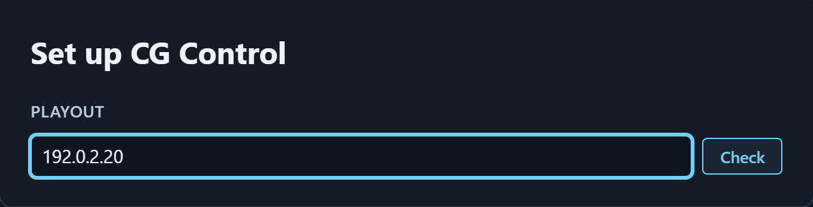

# راهنمای نصب APASAI CG — نسخهٔ آزمایشی `0.9.0`

این راهنما برای نصبِ بدون حضورِ ما نوشته شده است. گام‌ها را به همین ترتیب انجام دهید.

## ۱. در بسته چه هست

- `CG-Control_0.9.0_x64-setup.exe` — برنامهٔ کنترلِ گرافیک روی آنتن. روی رایانه‌ای جدا از سرور Playout نصب شود.
- `CG-Designer_0.9.0_x64-setup.exe` — برنامهٔ ساختِ قالب. روی رایانهٔ طراح نصب شود.
- `SHA256SUMS.txt` — برای وارسیِ درستیِ فایل‌ها.
- همین راهنما.

## ۲. پیش‌نیازها

- ویندوز ۱۰ یا ۱۱، ۶۴ بیتی. اینترنت لازم نیست.
- Playout نسخهٔ `2.9.0` یا تازه‌تر.
- رایانهٔ CG Control و Playout در یک شبکه باشند.
- رایانهٔ CG Control یک **IP ثابت** داشته باشد. Playout این رایانه را با IP آن می‌شناسد؛ اگر IP عوض شود، مدیر Playout باید دوباره آن را تأیید کند.
- پیش از شروع، از مدیر Playout بگیرید: **آدرس Playout**، و **گذرواژهٔ حساب `cg-admin`**.

## ۳. نصب CG Control

1. `CG-Control_0.9.0_x64-setup.exe` را اجرا کنید.
2. این نسخه امضای دیجیتال ندارد؛ ویندوز ممکن است صفحهٔ آبیِ `Windows protected your PC` را نشان دهد. روی `More info` و سپس `Run anyway` بزنید.
3. ویندوز اجازهٔ مدیر (Administrator) می‌خواهد؛ `Yes` را بزنید. نصب، دو درگاه را برای CasparCG در دیوارهٔ آتشِ ویندوز باز می‌کند (UDP 6250 و TCP 7911)؛ کار دیگری لازم نیست.

## ۴. اجرای نخست

1. CG Control را باز کنید. چند ثانیه صفحهٔ آغاز با نوشتهٔ `STARTING BRIDGE` دیده می‌شود.
2. پنجرهٔ `Set up CG Control` باز می‌شود. زیر `PLAYOUT` آدرس Playout را بنویسید (IP آن کافی است) و `Check` را بزنید. سطر CasparCG می‌گوید `waiting for sign-in`؛ این عادی است. سپس `Connect` را بزنید.
3. زیر `SIGN IN`، در `Username` بنویسید `cg-admin`. گذرواژه را در Playout بردارید: «تنظیمات ← اتصال به CG Control ← حسابِ داخلیِ CG Control»، با دکمهٔ کپیِ کنار آن. در `Password` بچسبانید و `Sign in` را بزنید.
4. نخستین رایانه‌ای که با `cg-admin` وارد شود خودکار پذیرفته می‌شود. اگر سطر CasparCG نوشت `waiting for approval`، مدیر Playout این رایانه را در همان صفحه («تنظیمات ← اتصال به CG Control») تأیید کند [confirm with the Playout team]. یک بار فهرستِ همان صفحه را ببینید: فقط همین رایانه باید آنجا باشد.
5. زیر `CHANNEL` کانال یا کانال‌هایی را که این رایانه کنترل می‌کند تیک بزنید. آدرسِ این رایانه زیر `SERVE ADDRESS` خودکار نوشته می‌شود؛ آن را تغییر ندهید، مگر به گفتهٔ مدیر Playout. سپس `Use this channel` (یا `Use these channels`) را بزنید.

## ۵. نصب CG Designer

1. `CG-Designer_0.9.0_x64-setup.exe` را اجرا کنید (همان هشدارِ ویندوز: `More info` و `Run anyway`). اجازهٔ مدیر و ورود لازم ندارد.
2. در صفحهٔ آغاز `+ New project` را بزنید، یا یکی از قالب‌های زیر `START FROM A TEMPLATE` را باز کنید، و قالب را بسازید.
3. پایینِ فهرستِ `Compositions`، دکمهٔ `Export (.vcg)` را بزنید و فایل را ذخیره کنید.
4. در CG Control، روی یک ردیف `LOAD` را بزنید؛ در پنجرهٔ باز شده `Import a .vcg` را بزنید و فایلِ `.vcg` را انتخاب کنید (یا فایل را روی همان پنجره بکشید).

## ۶. گزارش مشکل

1. در CG Control، بالای پنجره `LOG` را بزنید؛ در پنجرهٔ `Audit log` دکمهٔ `Open log folder` را بزنید.
2. همهٔ فایل‌های آن پوشه را، با یک عکس از صفحه و زمانِ دقیقِ رخداد، برای ما بفرستید.
3. نسخه: CG Control در `SETTINGS` (پایینِ ستونِ کناری) و CG Designer در صفحهٔ آغاز می‌نویسند `Version 0.9.0`.

## ۷. محدودیت‌های این نسخهٔ آزمایشی

- به‌روزرسانیِ خودکار ندارد؛ نسخهٔ تازه را خودتان نصب کنید.
- امضای دیجیتال ندارد؛ برای همین ویندوز هشدار می‌دهد.
- فقط یک حساب دارد: `cg-admin`.
